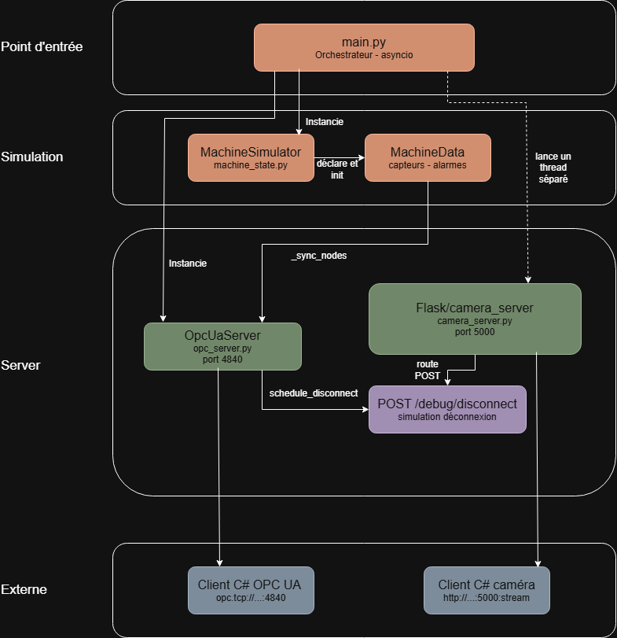

# MachineSight — Simulateur d'automate industriel (Serveur Raspberry Pi)

Serveur de simulation d'un automate industriel tournant sur Raspberry Pi.  
Expose les données machine via **OPC UA** (port 4840) et un **flux vidéo MJPEG** (port 5000).  
Inclut un endpoint de déconnexion pour tester la résilience du client C# (Polly).

---

## Architecture

```
main.py              Point d'entrée — orchestre les 3 composants en parallèle
machine_state.py     Simulation physique (capteurs, alarmes, cycles machine)
opc_server.py        Serveur OPC UA — expose les données, reçoit les commandes
camera_server.py     Capture webcam + streaming MJPEG HTTP + endpoints debug
```

> **Diagramme d'architecture**  
> 

---

## Installation sur Raspberry Pi

### 1. Prérequis

```bash
sudo apt update
sudo apt install python3-pip python3-opencv -y
pip3 install asyncua flask --break-system-packages
```

### 2. Copier les fichiers

```
~/apps/machinesight/
  ├── main.py
  ├── machine_state.py
  ├── opc_server.py
  └── camera_server.py
```

### 3. Trouver l'IP du Raspberry

```bash
hostname -I
# ex : 192.168.1.42
```

---

## Lancer le simulateur

```bash
cd ~/apps/machinesight

# Mode normal (caméra auto-détectée sur index 0)
python3 main.py

# Mode démo — démarrage automatique + injection d'une surtempérature après 30s
python3 main.py --demo

# Forcer un index caméra spécifique
python3 main.py --camera 1

# Sans caméra (OPC UA uniquement)
python3 main.py --no-camera
```

> Si aucune caméra physique n'est détectée, le serveur bascule automatiquement  
> en **mode fallback** : une image synthétique animée est générée à la place.

---

## Vérifier que ça fonctionne

Depuis un PC Windows sur le même réseau :

```
# Flux caméra (ouvrir dans Chrome)
http://192.168.1.42:5000/stream

# Statut caméra
http://192.168.1.42:5000/status

# Endpoint OPC UA (à configurer dans l'interface C#)
opc.tcp://192.168.1.42:4840/machinesight/simulator/
```

---

## Nodes OPC UA disponibles

Les NodeIds sont **fixes** et ne changent pas après une reconnexion.  
Namespace index : **2**

### Capteurs (lecture seule)

| NodeId | Nom | Type | Unité | Description |
|--------|-----|------|-------|-------------|
| 1002 | Temperature_C | Double | °C | Température moteur (normale : 60–80°C) |
| 1003 | Pressure_Bar | Double | bar | Pression hydraulique (normale : 2.5–4.0 bar) |
| 1004 | Speed_RPM | Double | tr/min | Vitesse de rotation (nominal : 1500 tr/min) |
| 1005 | Vibration_mms | Double | mm/s | Niveau de vibration (alarme > 8 mm/s) |
| 1006 | Current_A | Double | A | Courant moteur |
| 1007 | ProductionCount | Int64 | pcs | Compteur de pièces produites |
| 1008 | CycleTime_ms | Double | ms | Durée du dernier cycle |

### État machine (lecture seule)

| NodeId | Nom | Type | Description |
|--------|-----|------|-------------|
| 1011 | StatusCode | Int64 | 0=Arrêtée 1=Démarrage 2=Marche 3=Warning 4=Alarme 5=Urgence |
| 1012 | StatusLabel | String | Libellé lisible du statut |

### Alarmes (lecture seule)

| NodeId | Nom | Type | Description |
|--------|-----|------|-------------|
| 1021 | AlarmTemperature | Bool | Température > 85°C |
| 1022 | AlarmPressure | Bool | Pression hors plage |
| 1023 | AlarmVibration | Bool | Vibration > 6 mm/s |
| 1024 | AlarmEmergency | Bool | Arrêt d'urgence actif |

### Commandes (lecture/écriture)

| NodeId | Nom | Type | Description |
|--------|-----|------|-------------|
| 1031 | CmdStart | Bool | Écrire `true` pour démarrer la machine |
| 1032 | CmdStop | Bool | Écrire `true` pour arrêter normalement |
| 1033 | CmdEmergency | Bool | Écrire `true` pour arrêt d'urgence |
| 1034 | CmdResetAlarms | Bool | Écrire `true` pour réinitialiser les alarmes |
| 1035 | CmdInjectFault | Bool | Écrire `true` pour simuler une surtempérature |

---

## Endpoints HTTP (port 5000)

### Caméra

| Méthode | Endpoint | Description |
|---------|----------|-------------|
| GET | `/stream` | Flux MJPEG continu — consommé par le client C# |
| GET | `/snapshot` | Une seule frame JPEG |
| GET | `/status` | Statut caméra (fps, disponibilité) |

### Debug — Test de résilience Polly

Ces endpoints permettent de simuler une déconnexion OPC UA pour tester  
le comportement du client C# (retry exponentiel, circuit breaker).

| Méthode | Endpoint | Description |
|---------|----------|-------------|
| POST | `/debug/disconnect?seconds=N` | Coupe le serveur OPC UA pendant N secondes (1–120s, défaut : 5s) |
| GET | `/debug/status` | Retourne l'état courant du serveur OPC UA |

**Exemples :**

```bash
# Couper OPC UA pendant 15 secondes
curl -X POST "http://192.168.1.42:5000/debug/disconnect?seconds=15"
# → {"ok": true, "duration_s": 15, "message": "Serveur OPC UA sera hors ligne pendant 15s."}

# Vérifier l'état en boucle (PowerShell)
while ($true) { 
    curl -s "http://192.168.1.42:5000/debug/status"
    Start-Sleep 1 
}

# Double appel pendant une déconnexion en cours
curl -X POST "http://192.168.1.42:5000/debug/disconnect?seconds=10"
# → HTTP 409 {"ok": false, "message": "Déconnexion déjà en cours, réessayez plus tard."}
```